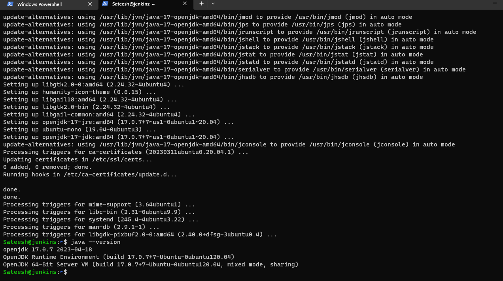

### INSTALLING JENKINS ON UBUNTU

FIRST STEP:
- Create Virtal machine on ubuntu and login to the machine and after you can install Java Version on VM

 
SECOND STEP:
Installing Steps on ubuntu machine following
---
curl -fsSL https://pkg.jenkins.io/debian-stable/jenkins.io-2023.key | sudo tee \
  /usr/share/keyrings/jenkins-keyring.asc > /dev/null
echo deb [signed-by=/usr/share/keyrings/jenkins-keyring.asc] \
  https://pkg.jenkins.io/debian-stable binary/ | sudo tee \
  /etc/apt/sources.list.d/jenkins.list > /dev/null
sudo apt-get update
sudo apt-get install jenkins
---
After executing all these steps you van verify the jenkins install in linux maxhine through following commands
---
sudo service status jenkins
sudo systemctl status jenkins
---
[preview](images.md/2.md.png)

Give to the vm to inbound port upto all ports on running
[preview](./images.md/3.md.png)

Now you can check on jenkins on using your publicip address through following commond
---
http://<public-ip>:8080
---
after that you can get following image
[preview](images.md/4.md.png)

you can view the jenkins administartor password using following commond
---
sudo cat /var/lib/jenkins/secrets/initialAdminPassword
---

After you can login to the jenkins
[preview](./images.md/5.md.png)
[preview](./images.md/6.md.png)
Create a first admin user
[preview](images.md/7.md.png)
Now you are ready to access jenkins
[preview](./images.md/8.md.png)
final dashboard of jenkins
[previes](./images.md/9.md.png)